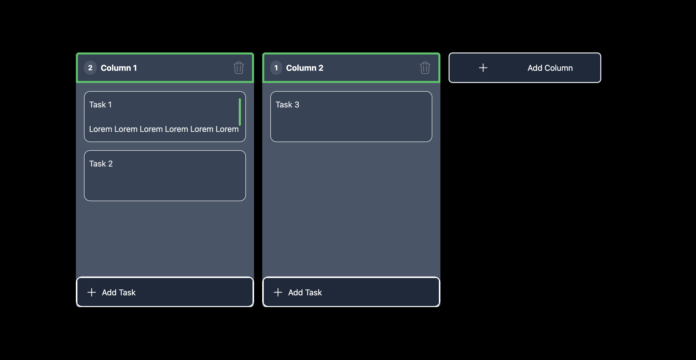

# Kanban Board Front-End



This is a Kanban Board application built using **React**, and **TypeScript** with the **dnd-kit library** enabling the creation, updating, and deletion of tasks and columns with drag and drop functionality.

## Features
- Manage Columns and Tasks: Create, update, and delete columns and tasks.
- Drag and Drop: Move tasks between columns or reorder columns as needed.
- Multi-line Task Input: Tasks support multi-line text input.
- Responsive Design: Adapts to various screen sizes.

## Drag-and-Drop Functionality
The drag-and-drop functionality is handled by the @dnd-kit library, which provides utilities for implementing drag-and-drop interactions in React applications.

## Dnd-kit Components:
- DndContext: Wraps the application to enable drag-and-drop behavior.
- PointerSensor: Manages pointer-based dragging.
- Drag Events: Use events like onDragStart, onDragOver, and onDragEnd to manage state.
- SortableContext: Defines the areas for sorting tasks.
- arrayMove Utility: Keeps tasks in the correct order when moved.


## Development Stack
This project uses the following tools and libraries:

- Vite: For the build tool and development server.
- TypeScript: For static type checking.
- Tailwind CSS: For styling the UI.
- React: The core JavaScript library for building components.
- @dnd-kit: For drag-and-drop interactions.


## Installation
To run the project locally, follow these steps:

``` sh
git clone <repository-url>
cd <repository-directory>
npm install
npm run dev
```

## Demo

<video controls src="kanban-demo.mp4" title="Demo"></video>